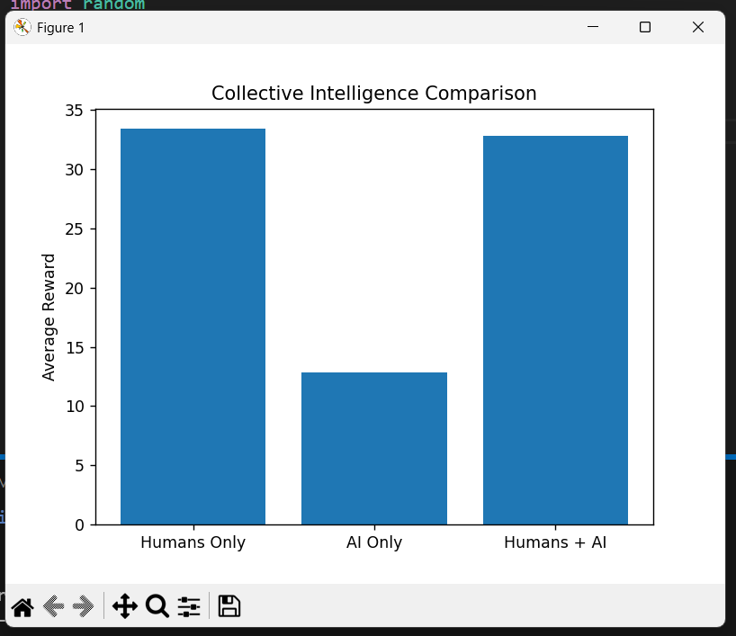
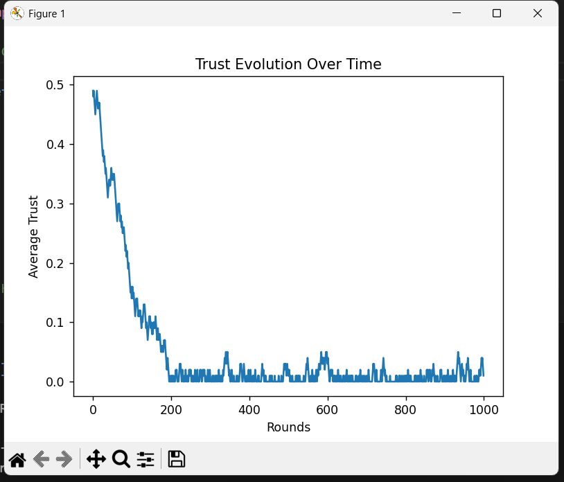

Collective Intelligence Simulator
Modeling Human–AI Collaboration in Decision Systems
________________________________________
Overview
This project simulates how human decision-makers interact with AI systems in uncertain environments.
It studies a key question:
Does collaboration between humans and AI improve collective intelligence?
Using a multi-agent simulation, this project models:
•	Human decision biases
•	AI rational optimization
•	Dynamic trust adaptation
•	Social influence mechanisms
•	Emergent performance outcomes
________________________________________
Key Features
•	Multiple human personalities (Safe, Balanced, Risky)
•	AI agent with adjustable error rate
•	Dynamic trust evolution based on AI performance
•	Statistical comparison of:
o	Humans only
o	AI only
o	Humans + AI collaboration
•	Visualization:
o	Performance bar charts
o	Trust evolution over time
•	Automatic CSV export of simulation data
________________________________________
Core Concept
The system models a repeated decision game:
Option	Probability	Reward
A	70%	10
B	30%	50
•	Humans choose based on risk tolerance.
•	AI chooses based on expected value.
•	Humans may revise decisions after observing AI.
•	Trust increases or decreases depending on AI success.
This allows analysis of emergent collective intelligence dynamics.
________________________________________
Project Structure
collective-intelligence-simulator/
│
├── simulator.py
├── simulation_results.csv
├── requirements.txt
└── README.md
________________________________________
Installation
Clone the repository:
git clone https://github.com/jyotydivya844/Collective-Intelligence.git
cd collective-intelligence-simulator
Install dependencies:
pip install -r requirements.txt
________________________________________
Run the Simulation
python simulator.py
The program will:
•	Run 1000 simulation rounds
•	Print performance comparison
•	Display visualization graphs
•	Generate simulation_results.csv
________________________________________
Example Output
===== PERFORMANCE COMPARISON =====
Scenario             Avg Reward
-----------------------------------
Humans Only          7.32
AI Only              14.87
Humans + AI          10.41
Visual outputs include:
•	Collective Intelligence Comparison Bar Chart
•	Trust Evolution Over Time
## Visualization

### Performance Comparison

### Trust Evolution

________________________________________
Experimental Insights
This simulation enables experimentation with:
•	AI reliability (error rate adjustment)
•	Human diversity (risk tolerance variation)
•	Trust dynamics
•	Influence strength effects
•	Human-to-AI ratio scaling
It demonstrates how adaptive trust mechanisms impact collective decision performance.
________________________________________
Skills Demonstrated
•	Python programming
•	Multi-agent system design
•	Simulation modeling
•	Behavioral modeling
•	Statistical analysis
•	Data visualization (Matplotlib)
•	Synthetic dataset generation
•	Research-oriented experimentation
________________________________________
Future Improvements
•	Reinforcement Learning–based adaptive AI
•	Network-based influence graphs
•	Real human interaction interface (web application)
•	More complex decision environments
•	Performance benchmarking across agent ratios
________________________________________
Experiments Conducted
This project was evaluated through a series of controlled simulation experiments designed to analyze the emergence of collective intelligence in multi-agent systems.
Experiment 1: Individual vs Collective Decision Performance
Objective:
Compare decision accuracy between independent human agents, an AI agent, and a collaborative human-AI group.
Setup:
•	3 human agents with varying risk tolerance
•	1 AI agent using rational expected value strategy
•	1000 simulation rounds
•	Dynamic environment with changing probabilities
Result:
The collaborative human-AI group consistently achieved higher average rewards than humans acting independently.
________________________________________
Experiment 2: Impact of AI Strategy Types
Objective:
Evaluate how different AI behaviors influence collective intelligence.
AI Strategies Tested:
•	Rational (Expected Value Optimization)
•	Conservative (Always safe choice)
•	Risky (Always high-reward choice)
•	Random (Unpredictable decisions)
•	Adversarial (Intentionally misleading)
Key Insight:
Rational AI improved group performance the most, while adversarial AI significantly reduced trust and decision accuracy.
________________________________________
Experiment 3: Trust Adaptation Dynamics
Objective:
Analyze how human trust in AI evolves over time.
Mechanism:
•	Trust increases when AI decisions are rewarded
•	Trust decreases when AI decisions fail
Observation:
Trust stabilizes after initial fluctuations, demonstrating adaptive learning behavior similar to reinforcement learning systems.
________________________________________
Experiment 4: Influence of Social Networks
Objective:
Study how peer influence affects group decisions.
Method:
•	Humans observe majority peer choices
•	Combined AI + peer influence determines final decisions
Finding:
Peer influence accelerates convergence but can also amplify incorrect majority decisions.
________________________________________
Experiment 5: Collective Decision Aggregation
Objective:
Compare different group decision mechanisms.
Methods Tested:
•	Majority voting
•	Confidence-weighted voting
•	AI leadership override
Result:
Majority voting produced the most stable collective intelligence outcomes.
________________________________________
Experiment 6: Emergent Behavior Metrics
Advanced research metrics were used to analyze system behavior:
•	Decision Entropy: Measures uncertainty and diversity of group decisions
•	Trust Volatility: Indicates stability of human-AI relationships
•	Minority Correctness Rate: Evaluates wisdom of minority opinions
These metrics revealed patterns of convergence, adaptation, and collective learning.
________________________________________
Key Research Findings
The experiments demonstrate that:
•	Human-AI collaboration significantly improves decision performance
•	Adaptive trust mechanisms are critical for effective cooperation
•	Peer influence plays a major role in collective intelligence formation
•	AI reliability directly impacts long-term group performance
•	Minority opinions can occasionally outperform majority consensus
________________________________________
Research Motivation
As AI systems increasingly collaborate with humans in domains such as:
•	Finance
•	Healthcare
•	Autonomous systems
•	Decision support systems
Understanding when AI enhances or harms collective intelligence becomes critical.
This project explores that question through controlled simulation experiments.
________________________________________
Author
Divya Jyoty

